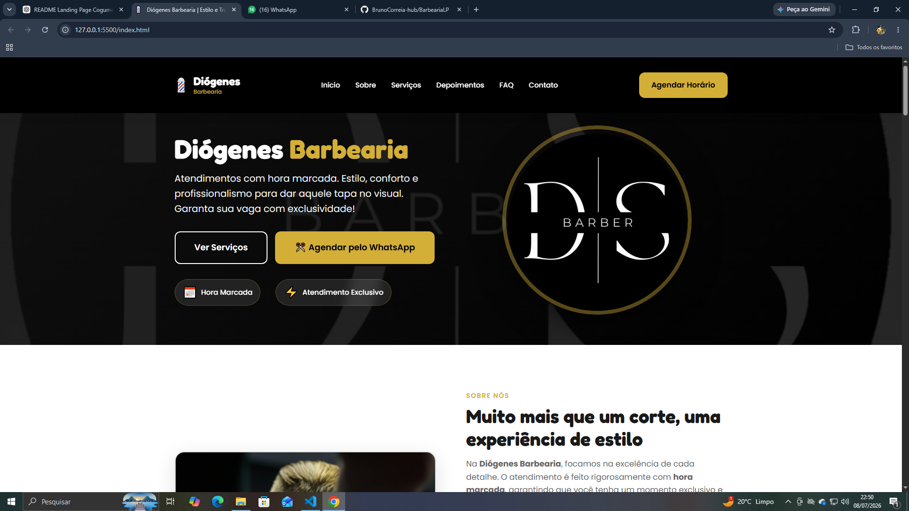
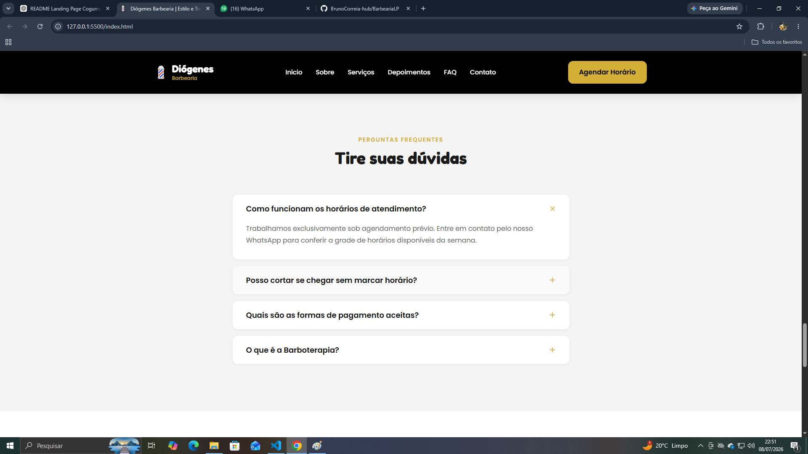
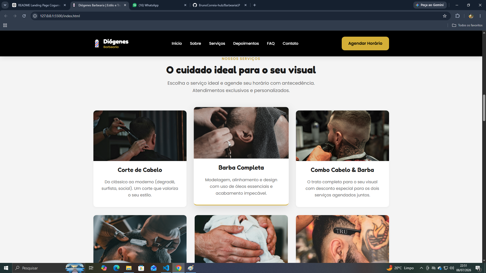

# 💈 Landing Page - Barbearia

Uma landing page moderna e totalmente responsiva desenvolvida para uma barbearia, com o objetivo de apresentar o estabelecimento, destacar os serviços oferecidos e facilitar o contato com os clientes por meio do WhatsApp.

O projeto foi desenvolvido utilizando **HTML**, **CSS** e **JavaScript**, com foco em uma interface elegante, navegação intuitiva e uma excelente experiência em diferentes dispositivos.

---

## 📸 Preview


<p align="center">
  
  
  
</p>


---

## 🚀 Tecnologias Utilizadas

* HTML5
* CSS3
* JavaScript (ES6)

---

## ✨ Funcionalidades

* 💈 Seção Sobre a Barbearia
* ✂️ Apresentação dos serviços
* 📲 Botão para agendamento via WhatsApp
* 🖼️ Galeria de fotos
* 📱 Layout totalmente responsivo
* 🎨 Interface moderna e intuitiva

---

## 📂 Estrutura do Projeto

```text
├── index.html
├── css
│   └── style.css
├── js
│   └── script.js
├── img
│   ├── banner
│   ├── galeria
│   └── ...
└── README.md
```

---

## 💻 Como executar o projeto

1. Clone este repositório:

```bash
git clone https://github.com/BrunoCorreia-hub/nome-do-repositorio.git
```

2. Acesse a pasta do projeto:

```bash
cd nome-do-repositorio
```

3. Abra o arquivo `index.html` no navegador.

Para uma melhor experiência durante o desenvolvimento, utilize a extensão **Live Server** no Visual Studio Code.

---

## 🎯 Objetivos do Projeto

Este projeto foi desenvolvido com o objetivo de praticar conceitos fundamentais do desenvolvimento Front-end, como:

* Estruturação semântica com HTML5;
* Estilização utilizando CSS3;
* Layout responsivo para diferentes dispositivos;
* Manipulação do DOM com JavaScript;
* Organização e boas práticas na construção de Landing Pages.

---

## 📱 Responsividade

A aplicação foi desenvolvida para proporcionar uma ótima experiência em diferentes tamanhos de tela, incluindo:

* 💻 Desktop
* 📱 Smartphones
* 📟 Tablets

---

## 📚 Aprendizados

Durante o desenvolvimento deste projeto foram aplicados conhecimentos sobre:

* HTML semântico;
* CSS Flexbox e Grid Layout;
* Responsividade com Media Queries;
* Manipulação de eventos utilizando JavaScript;
* Organização e reutilização de estilos;
* Boas práticas na construção de interfaces modernas.

---

## 🔮 Melhorias Futuras

* [ ] Formulário de contato funcional
* [ ] Sistema de agendamento integrado
* [ ] Animações com JavaScript
* [ ] Modo escuro (Dark Mode)
* [ ] Melhorias de acessibilidade
* [ ] Otimização de performance e SEO

---

## 👨‍💻 Autor

Desenvolvido por **Bruno Correia**.

* GitHub: https://github.com/BrunoCorreia-hub
* LinkedIn: https://www.linkedin.com/in/bruno-correia-oliveira/

---

## 📄 Licença

Este projeto foi desenvolvido para fins de estudo, prática e composição de portfólio.
